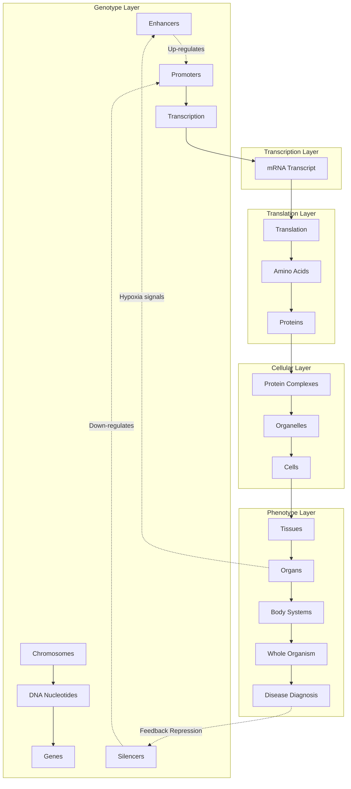

# BioGenesis Biology Engine Architecture Specification
**Version:** 1.0.0  
**Authors:** Lead Game Architect, Senior Systems Biologist, and Lead Bioinformatician

---

## Executive Summary
This document specifies the technical design of the **BioGenesis Biology Engine**, a modular, graph-based simulation engine that models molecular biology, genetics, cellular signaling, tissue performance, and systemic human physiology. The engine is designed to operate as a deterministic directed acyclic graph (DAG) where changes at the sub-genomic layer propagate through translation layers to yield phenotype anomalies and clinical pathologies.

---

## PART 1: Biological Layers Architecture

The engine is structured into 19 hierarchical biological layers. Each layer represents a biological entity or system, managing state, input constraints, and output telemetry.

### 1. Chromosomes
- **Purpose**: Models the physical structure of genomic storage and chromatin access.
- **Inputs**: Histone acetylation index, DNA methylation density.
- **Outputs**: Chromatin accessibility matrix (open vs. heterochromatin state).
- **Dependencies**: Histone modifiers.
- **Child Nodes**: Genes, Promoters.
- **Parent Nodes**: Whole Organism.
- **Editable Properties**: Chromosome number, epigenetic compaction factor.
- **Future Expansion**: Chromosomal crossover, sister chromatid exchange, karyotype aberrations (e.g., trisomy).

### 2. DNA
- **Purpose**: Stores the raw nucleotide sequences representing exons, introns, and regulatory structures.
- **Inputs**: Polymerase binding status, nucleotide excision repair activity.
- **Outputs**: Nucleotide sequence strings (triplets/codons).
- **Dependencies**: DNA repair enzymes.
- **Child Nodes**: Codons, base pairs.
- **Parent Nodes**: Chromosomes.
- **Editable Properties**: Nucleotide bases (A, T, C, G), methylation status.
- **Future Expansion**: DNA damage templates (thymine dimers, oxidative damage), telomeric repeat lengths.

### 3. Genes
- **Purpose**: Acts as transcription units encoding functional polypeptides or non-coding RNA.
- **Inputs**: Transcription factor occupancy, promoter status.
- **Outputs**: Primary pre-mRNA nucleotide sequence.
- **Dependencies**: Promoters, Enhancers, Silencers.
- **Child Nodes**: mRNA.
- **Parent Nodes**: Chromosomes.
- **Editable Properties**: Exon coordinates, splice site junctions, mutation tolerance indices.
- **Future Expansion**: Alternative splicing maps, intron retention, gene duplication rates.

### 4. Promoters
- **Purpose**: Regulates the transcription initiation rate.
- **Inputs**: RNA Polymerase II affinity, Transcription Factor (TF) binding.
- **Outputs**: Gene activation level (0.0 to 1.0).
- **Dependencies**: TFs, CpG island methylation.
- **Child Nodes**: Genes.
- **Parent Nodes**: Genes.
- **Editable Properties**: TATA box sequence, TF consensus binding sequences.
- **Future Expansion**: Core vs. proximal promoter elements, CpG island density.

### 5. Enhancers
- **Purpose**: Amplifies gene transcription rates via chromatin looping.
- **Inputs**: Pioneer transcription factors.
- **Outputs**: Amplification multiplier ($E_{mult} \in [1.0, 10.0]$).
- **Dependencies**: Chromatin looping factors (e.g., Cohesin).
- **Child Nodes**: Promoters (via edges).
- **Parent Nodes**: Genes.
- **Editable Properties**: Distance to promoter, TF binding site density.
- **Future Expansion**: Super-enhancer complexes, stretch enhancers.

### 6. Silencers
- **Purpose**: Suppresses gene transcription.
- **Inputs**: Repressor protein binding.
- **Outputs**: Silencing factor ($S_{factor} \in [0.0, 1.0]$).
- **Dependencies**: Repressor concentrations.
- **Child Nodes**: Promoters.
- **Parent Nodes**: Genes.
- **Editable Properties**: Repressor consensus sequences.
- **Future Expansion**: Polycomb response elements, heterochromatin spreading.

### 7. Transcription
- **Purpose**: Computes primary transcript pre-mRNA synthesis.
- **Inputs**: Gene activation level, RNA Polymerase speed.
- **Outputs**: pre-mRNA molecule.
- **Dependencies**: RNA Polymerase II, splicing factors.
- **Child Nodes**: mRNA.
- **Parent Nodes**: Genes.
- **Editable Properties**: Transcription rate ($nt/sec$), elongation abort rate.
- **Future Expansion**: Transcription stalling, RNA-DNA hybrid formations (R-loops).

### 8. mRNA
- **Purpose**: Represents processed transcripts ready for cytosolic translation.
- **Inputs**: pre-mRNA sequences, spliceosome splicing choices.
- **Outputs**: Mature mRNA codon sequence.
- **Dependencies**: Spliceosomes, nuclear export factors.
- **Child Nodes**: Amino Acids.
- **Parent Nodes**: Transcription.
- **Editable Properties**: Poly-A tail length, 5' cap status, half-life (seconds).
- **Future Expansion**: mRNA decay pathways (Nonsense-Mediated Decay), RNA editing (A-to-I editing).

### 9. Translation
- **Purpose**: Synthesizes linear polypeptide chains from mRNA templates.
- **Inputs**: Mature mRNA, tRNA-amino acid complexes, Ribosome availability.
- **Outputs**: Nascent amino acid sequence (polypeptide).
- **Dependencies**: Ribosomes, translation initiation factors.
- **Child Nodes**: Amino Acids.
- **Parent Nodes**: mRNA.
- **Editable Properties**: Translation initiation efficiency, elongation rate.
- **Future Expansion**: Ribosomal pausing, codon bias calculators.

### 10. Amino Acids
- **Purpose**: Defines the physical-chemical traits of individual polypeptide subunits.
- **Inputs**: Codon index.
- **Outputs**: Hydrophobicity index, steric size, charge.
- **Dependencies**: Codon-tRNA pairing rules.
- **Child Nodes**: Proteins.
- **Parent Nodes**: Translation.
- **Editable Properties**: Residue type (charge, polarity, size).
- **Future Expansion**: Non-standard amino acids, post-translational modifications (phosphorylation).

### 11. Proteins
- **Purpose**: The functional workforce, folding into tertiary structures.
- **Inputs**: Polypeptide sequences, chaperone folder status.
- **Outputs**: Active site status, binding affinities, structural rigidity.
- **Dependencies**: Amino Acids, Chaperones.
- **Child Nodes**: Protein Complexes, Organelles.
- **Parent Nodes**: Amino Acids.
- **Editable Properties**: Fold stability ($\Delta G$ folding value), half-life.
- **Future Expansion**: Misfolding aggregation kinetics, amyloid fibril maps.

### 12. Protein Complexes
- **Purpose**: Multi-subunit assemblies forming functional macromolecular machines.
- **Inputs**: Multiple folded protein subunits.
- **Outputs**: Combined catalytic capacity, regulatory feedback.
- **Dependencies**: Subunit stoichiometry, local pH, binding kinetics.
- **Child Nodes**: Organelles.
- **Parent Nodes**: Proteins.
- **Editable Properties**: Subunit ratios, cooperative binding coefficients.
- **Future Expansion**: Allosteric regulation maps, transient signalosomes.

### 13. Organelles
- **Purpose**: Sub-cellular compartments running specific metabolic or physiological programs.
- **Inputs**: Membrane channels, enzyme sets.
- **Outputs**: ATP yields, vesicular transit rates, ion gradients.
- **Dependencies**: Membrane proteins, targeting signal peptide sequences.
- **Child Nodes**: Cells.
- **Parent Nodes**: Protein Complexes.
- **Editable Properties**: Membrane permeability, organelle counts.
- **Future Expansion**: Mitochondrial fission/fusion, lysosomal autophagy rates.

### 14. Cells
- **Purpose**: The fundamental unit of life, maintaining homeostasis.
- **Inputs**: Receptor signals, nutrient gradients, membrane potentials.
- **Outputs**: Cytokine secretions, mechanical forces, cellular division/death triggers.
- **Dependencies**: Organelles, cytoskeletal elements.
- **Child Nodes**: Tissues.
- **Parent Nodes**: Organelles.
- **Editable Properties**: Membrane integrity index, intracellular pH, apoptosis threshold.
- **Future Expansion**: Stem cell differentiation, lineage tracking.

### 15. Tissues
- **Purpose**: Cellular assemblies running cooperative mechanical or physiological actions.
- **Inputs**: Capillary perfusions, extracellular matrix density, tissue shear stress.
- **Outputs**: Fluid transit resistance, tensile strength, barrier leak rates.
- **Dependencies**: Cell adhesion proteins, extracellular matrix.
- **Child Nodes**: Organs.
- **Parent Nodes**: Cells.
- **Editable Properties**: Cellular density, interstitial fluid pressure.
- **Future Expansion**: Angiogenesis pathways, scar tissue fibrosis indices.

### 16. Organs
- **Purpose**: Complex functional systems performing systemic jobs.
- **Inputs**: Arterial blood pressure, hormonal levels, sensory stimuli.
- **Outputs**: Filtration rates, respiratory gas volumes, neural signals.
- **Dependencies**: Tissues.
- **Child Nodes**: Body Systems.
- **Parent Nodes**: Tissues.
- **Editable Properties**: Functional capacity index ($[0\%, 100\%]$), tissue damage index ($[0\%, 100\%]$).
- **Future Expansion**: Regenerative growth dynamics, donor matching templates.

### 17. Body Systems
- **Purpose**: Linked organs coordinating major systemic functions.
- **Inputs**: Metabolic demand, autonomic nervous tones.
- **Outputs**: Core pH stability, arterial oxygenation, immune cell profiles.
- **Dependencies**: Organs.
- **Child Nodes**: Whole Organism.
- **Parent Nodes**: Organs.
- **Editable Properties**: Autonomic tone balance, hormone feedback loops.
- **Future Expansion**: Inter-system feedback models (e.g., hypothalamic-pituitary-adrenal axis).

### 18. Whole Organism
- **Purpose**: The integrated host system, presenting macroscopic symptoms and vital signs.
- **Inputs**: Nutrients, toxin exposures, systemic pathogen loads.
- **Outputs**: Heart rate, core temperature, blood pressure, motor capacity.
- **Dependencies**: Body Systems.
- **Child Nodes**: None.
- **Parent Nodes**: Body Systems.
- **Editable Properties**: Age, genetic ancestry profiles, environmental toxicity logs.
- **Future Expansion**: Behavior feedback loops, metabolic adaptabilities to hypoxia.

### 19. Disease
- **Purpose**: Classifies pathological states arising from translation failures or homeostatic deviations.
- **Inputs**: Cumulative tissue and organ telemetry damage flags.
- **Outputs**: Pathology index, diagnostic symptoms, mortality risks.
- **Dependencies**: Whole Organism, Organs, Tissues, Cells.
- **Child Nodes**: None.
- **Parent Nodes**: Whole Organism.
- **Editable Properties**: Diagnostic criteria flags, clinical severity levels.
- **Future Expansion**: Multi-morbidity interactions, epigenetic disease modifiers.

---

## PART 2: Translation Dependency Graphs

Biological data flows unidirectionally from genotype to phenotype, while regulation flows via feedback loops. The system is modeled as a Directed Acyclic Graph (DAG) with feedback edges running outside the main execution cycle.



### Dependency Properties Matrix
Every node in the graph contains properties describing its relationships:

| Node Locus | Affects (Out) | Affected By (In) | Outcomes | Valid Relationships |
| :--- | :--- | :--- | :--- | :--- |
| **Gene (HBB)** | mRNA sequence | Promoters, DNA methylation | Codon GAG/GTG transcripts | Active state on Chromosome 11 |
| **Mutation (GAG→GTG)** | Valine residue | Exon codon coordinates | Hemoglobin aggregation | Valid only at codon 6 |
| **Protein (HbS)** | RBC membrane | Amino acid charge, hydrophobicity | Sticky HbS fiber structures | Polymerizes under hypoxia |
| **Cell (Sickle RBC)** | Blood flow | HbS fiber rigidity, ATP rate | Vaso-occlusion in vessels | Biconcave disk morphs to crescent |
| **Organ (Spleen)** | Overall health | Red cell filtration rates | Splenic congestion, necrosis | Normal clearing vs. congestion |

---

## PART 3: 37 Biological Segments

The engine manages 37 specific biological systems, mapping them to selectable parameters.

### 1. Amino Acid Sequence
- **Description**: The linear sequence of amino acids forming a polypeptide.
- **Editable Options**: Codon mutations (e.g. missense, nonsense, silent).
- **Biological Meaning**: Directly dictates folding chemistry ($\Delta G$).
- **Compatible Inputs**: mRNA sequence.
- **Compatible Outputs**: Protein tertiary structure.
- **Diseases**: All genetic diseases.
- **Difficulty**: Student (Easy).
- **Game Mechanics**: Point-and-click codon base editor.
- **Scientific Explanation**: Substitution changes physical properties of residue (size, charge).
- **Example**: GAG (Glu) to GTG (Val) change.

### 2. Protein Folding
- **Description**: The physical process by which a polypeptide folds into a 3D structure.
- **Editable Options**: Folding temperature, chaperone helper concentrations.
- **Biological Meaning**: Stabilizes structural energy.
- **Compatible Inputs**: Amino Acid sequence.
- **Compatible Outputs**: Protein Stability.
- **Diseases**: Cystic Fibrosis.
- **Difficulty**: genetics Intern (Medium).
- **Game Mechanics**: Interactive slider adjusting hydrophobic collapse velocity.
- **Scientific Explanation**: Disruption leads to endoplasmic reticulum associated degradation (ERAD).
- **Example**: CFTR deletion of F508 blocks folding pathways.

### 3. Protein Stability
- **Description**: The ability of a protein to resist denaturing under physical stress.
- **Editable Options**: Solute pH, salt concentration.
- **Biological Meaning**: Determines protein half-life.
- **Compatible Inputs**: Folding parameters.
- **Compatible Outputs**: Active protein concentration.
- **Diseases**: Phenylketonuria.
- **Difficulty**: Molecular Biologist (Medium).
- **Game Mechanics**: Dynamic bar balancing cellular pH constraints.
- **Example**: PAH instability under elevated oxidative stresses.

### 4. Protein Shape
- **Description**: The tertiary structural outline of the protein.
- **Editable Options**: Disulfide bond toggles, pocket volume adjusters.
- **Biological Meaning**: Determines binding pocket geometry.
- **Compatible Inputs**: Amino Acid sequences.
- **Compatible Outputs**: Active Site availability.
- **Diseases**: Sickle Cell Anemia.
- **Difficulty**: Systems Biologist (Hard).
- **Example**: Sickled hemoglobin aggregates because of hydrophobic surface pocket protrusion.

### 5. Active Site
- **Description**: The catalytic core of an enzyme where substrates bind.
- **Editable Options**: Catalytic residues, pocket depth.
- **Biological Meaning**: Controls substrate conversion rate ($K_m$ and $V_{max}$).
- **Compatible Inputs**: Protein Shape.
- **Compatible Outputs**: Metabolism performance.
- **Diseases**: Phenylketonuria, Hemophilia B.
- **Difficulty**: Principal Investigator (Hard).
- **Example**: Mutation at catalytic triad in F9 stops clotting cascade.

### 6. Receptor Binding Site
- **Description**: Surface domains interacting with target cells or hormones.
- **Editable Options**: Affinity coefficients.
- **Biological Meaning**: Alters ligand-receptor binding capacity.
- **Compatible Inputs**: Active site pocket shape.
- **Compatible Outputs**: Cellular signaling pathways.
- **Diseases**: Type II Diabetes.
- **Difficulty**: Systems Biologist (Hard).
- **Example**: Mutated insulin receptor fails to bind ligand.

### 7. Ion Channels
- **Description**: Membrane-spanning pore proteins regulating ion transit.
- **Editable Options**: Gate voltage triggers, opening time (ms).
- **Biological Meaning**: Establishes membrane potential and osmotic draw.
- **Compatible Inputs**: Membrane proteins.
- **Compatible Outputs**: Cell hydration.
- **Diseases**: Cystic Fibrosis.
- **Difficulty**: Disease Engineer (Hard).
- **Example**: Defective CFTR blocks chloride exit, causing sticky mucus.

### 8. Transport Proteins
- **Description**: Carrier molecules moving solutes across membranes.
- **Editable Options**: Binding affinity.
- **Biological Meaning**: Regulates amino acid or nutrient intake.
- **Compatible Inputs**: Cell membrane.
- **Compatible Outputs**: Intracellular nutrient counts.
- **Diseases**: PKU.
- **Difficulty**: Molecular Biologist (Medium).
- **Example**: LAT-1 transporter oversaturation in neural membranes.

### 9. Structural Proteins
- **Description**: Fibers and scaffolding giving shape to cell walls and tissues.
- **Editable Options**: Elasticity modules.
- **Biological Meaning**: Stabilizes cell morphology.
- **Compatible Inputs**: Folding stability.
- **Compatible Outputs**: Cell shear tolerance.
- **Diseases**: Duchenne Muscular Dystrophy.
- **Difficulty**: genetics Intern (Medium).
- **Example**: Dystrophin structural failures trigger muscle membrane leaks.

### 10. Protein Cleavage
- **Description**: Enzymatic processing of precursor proteins into active units.
- **Editable Options**: Protease concentrations.
- **Biological Meaning**: Activates zymogens and pro-hormones.
- **Compatible Inputs**: Amino Acid sequences.
- **Compatible Outputs**: Protein activation.
- **Diseases**: Alzheimer's Disease.
- **Difficulty**: Principal Investigator (Hard).
- **Example**: Incomplete cleavage of APP yields amyloid-beta sheets.

### 11. Post Translational Modification
- **Description**: Chemical modifications (phosphorylation, ubiquitination) of folded proteins.
- **Editable Options**: Kinase activation levels.
- **Biological Meaning**: Switches enzyme activity states.
- **Compatible Inputs**: Folding pathways.
- **Compatible Outputs**: Signal transduction pathways.
- **Diseases**: Oncogenic signaling pathways.
- **Difficulty**: Systems Biologist (Hard).
- **Example**: Chronic phosphorylation keeps growth pathways open.

### 12. Protein Localization
- **Description**: Directs proteins to target organelles or cell membranes.
- **Editable Options**: Target signal peptides.
- **Biological Meaning**: Moves active proteins to functional spaces.
- **Compatible Inputs**: Post translational status.
- **Compatible Outputs**: Organelle functionality.
- **Diseases**: Cystic Fibrosis.
- **Difficulty**: Disease Engineer (Hard).
- **Example**: Mutant CFTR is held back in endoplasmic reticulum and degraded.

### 13. Protein Half Life
- **Description**: The rate of proteasome-mediated degradation.
- **Editable Options**: Ubiquitination rate.
- **Biological Meaning**: Sets the duration of protein activity.
- **Compatible Inputs**: Folding stability.
- **Compatible Outputs**: Protein concentrations.
- **Diseases**: Familial cancers.
- **Difficulty**: genetics Intern (Medium).
- **Example**: Mutated p53 protein stability drops, accelerating tumor growth.

### 14. mRNA Sequence
- **Description**: The single-stranded RNA template translated by ribosomes.
- **Editable Options**: Triplet codon swaps.
- **Biological Meaning**: Dictates translation residues.
- **Compatible Inputs**: Transcription results.
- **Compatible Outputs**: Amino Acid sequences.
- **Diseases**: Sickle Cell.
- **Difficulty**: Student (Easy).
- **Example**: GUG codon template transcription instead of GAG.

### 15. mRNA Splicing
- **Description**: The removal of introns and joining of exons.
- **Editable Options**: Splice site mutations.
- **Biological Meaning**: Dictates protein isoform diversity.
- **Compatible Inputs**: pre-mRNA sequences.
- **Compatible Outputs**: Mature mRNA sequences.
- **Diseases**: Spinal Muscular Atrophy.
- **Difficulty**: Principal Investigator (Hard).
- **Example**: Splice junction loss deletes Exon 7 from SMN2 transcript.

### 16. mRNA Stability
- **Description**: Resistance to decay by cytosolic exonucleases.
- **Editable Options**: Poly-A tail length, 3' UTR sequence editing.
- **Biological Meaning**: Controls mRNA half-life.
- **Compatible Inputs**: pre-mRNA processing.
- **Compatible Outputs**: Elongation efficiency.
- **Diseases**: Alpha Thalassemia.
- **Difficulty**: Molecular Biologist (Medium).
- **Example**: 3' UTR mutation destabilizes alpha-globin mRNA.

### 17. Translation Efficiency
- **Description**: The speed and rate of ribosome loading on mRNA.
- **Editable Options**: Kozak sequence mutations.
- **Biological Meaning**: Controls translation rates.
- **Compatible Inputs**: mRNA stability.
- **Compatible Outputs**: Polypeptide quantities.
- **Diseases**: Beta Thalassemia.
- **Difficulty**: genetics Intern (Medium).
- **Example**: Ribosome binding site mutations decrease beta-globin synthesis.

### 18. Transcription Factors
- **Description**: Proteins binding DNA to initiate gene transcription.
- **Editable Options**: Binding affinity sliders.
- **Biological Meaning**: Controls promoter recruitment rates.
- **Compatible Inputs**: Promoter availability.
- **Compatible Outputs**: Gene activation.
- **Diseases**: Leukemia.
- **Difficulty**: Disease Engineer (Hard).
- **Example**: Overactive TF forces cell cycle acceleration.

### 19. Promoter Activity
- **Description**: The baseline recruitment rate of transcription complexes.
- **Editable Options**: Transcription Factor binding density.
- **Biological Meaning**: Sets basal expression limits.
- **Compatible Inputs**: Promoters.
- **Compatible Outputs**: Transcription rates.
- **Diseases**: Thalassemia.
- **Difficulty**: Molecular Biologist (Medium).
- **Example**: Mutated HBB promoter decreases transcription rates.

### 20. Enhancer Activity
- **Description**: Up-regulation of gene transcription via distal elements.
- **Editable Options**: Loop distance parameters.
- **Biological Meaning**: Boosts transcription levels.
- **Compatible Inputs**: Chromatin looping factors.
- **Compatible Outputs**: Transcription rates.
- **Diseases**: Microcephaly.
- **Difficulty**: Systems Biologist (Hard).
- **Example**: Enhancer mutation shuts down sonic hedgehog expression.

### 21. Silencer Activity
- **Description**: Active repression of target genes.
- **Editable Options**: Repressor density parameters.
- **Biological Meaning**: Suppresses transcriptional leakage.
- **Compatible Inputs**: Silencer elements.
- **Compatible Outputs**: Transcription repression.
- **Diseases**: Huntington's Disease.
- **Difficulty**: Principal Investigator (Hard).
- **Example**: Loss of silencer control causes aberrant huntingtin transcription.

### 22. DNA Methylation
- **Description**: Epigenetic addition of methyl groups to cytosine bases.
- **Editable Options**: Methylation density percentage.
- **Biological Meaning**: Suppresses transcription by preventing TF binding.
- **Compatible Inputs**: DNA.
- **Compatible Outputs**: Chromatin accessibility.
- **Diseases**: Prader-Willi Syndrome.
- **Difficulty**: genetics Intern (Medium).
- **Example**: Hypermethylation silences gene expression on chromosome 15.

### 23. Histone Modification
- **Description**: Post-translational changes in histone tails.
- **Editable Options**: Acetylation vs. methylation toggles.
- **Biological Meaning**: Relaxes (acetylation) or compacts (methylation) chromatin.
- **Compatible Inputs**: Chromosomes.
- **Compatible Outputs**: Chromatin accessibility.
- **Diseases**: Rubinstein-Taybi Syndrome.
- **Difficulty**: Disease Engineer (Hard).
- **Example**: Histone deacetylation silences tumor suppressor genes.

### 24. DNA Repair
- **Description**: Cellular mechanisms correcting DNA lesions.
- **Editable Options**: Polymerase fidelity settings.
- **Biological Meaning**: Lowers genomic mutation accumulation rates.
- **Compatible Inputs**: DNA.
- **Compatible Outputs**: Mutation rate.
- **Diseases**: Xeroderma Pigmentosum.
- **Difficulty**: Student (Easy).
- **Example**: Unpaired base mismatches trigger rapid oncogene development.

### 25. DNA Replication
- **Description**: Duplication of genetic material before division.
- **Editable Options**: Elongation velocity.
- **Biological Meaning**: Maintains genome replication accuracy.
- **Compatible Inputs**: DNA.
- **Compatible Outputs**: Cell division rate.
- **Diseases**: Microcephaly.
- **Difficulty**: genetics Intern (Medium).
- **Example**: Stalled replication forks trigger p53-dependent apoptosis.

### 26. Gene Copy Number
- **Description**: The number of copies of a gene on a chromosome.
- **Editable Options**: Gene duplication events.
- **Biological Meaning**: Directly scales protein expression capacity.
- **Compatible Inputs**: Chromosomes.
- **Compatible Outputs**: Basal protein concentrations.
- **Diseases**: Charcot-Marie-Tooth disease.
- **Difficulty**: Molecular Biologist (Medium).
- **Example**: PMP22 duplication raises protein levels, causing demyelination.

### 27. Chromosome Structure
- **Description**: Macro-organization of chromatin fibers.
- **Editable Options**: Translocation events.
- **Biological Meaning**: Modulates chromatin accessibility.
- **Compatible Inputs**: Chromosomes.
- **Compatible Outputs**: Gene expression maps.
- **Diseases**: Down Syndrome, Philadelphia Chromosome.
- **Difficulty**: Disease Engineer (Hard).
- **Example**: Translocation between Chromosomes 9 and 22 yields BCR-ABL fusion.

### 28. Cell Signalling
- **Description**: Transduction cascades (e.g. MAPK, cAMP) directing cell actions.
- **Editable Options**: Ligand concentrations.
- **Biological Meaning**: Converts environmental inputs to gene expression changes.
- **Compatible Inputs**: Receptor sites.
- **Compatible Outputs**: Cell state changes.
- **Diseases**: Cancers.
- **Difficulty**: Systems Biologist (Hard).
- **Example**: KRAS mutations force constant cell proliferation signals.

### 29. Cell Cycle
- **Description**: The phases ($G_1, S, G_2, M$) regulating cellular replication.
- **Editable Options**: Cyclin checkpoint sensitivity.
- **Biological Meaning**: Controls tissue cellular replacement rate.
- **Compatible Inputs**: DNA integrity, signaling pathways.
- **Compatible Outputs**: Tissue growth.
- **Diseases**: Leukemia, sarcomas.
- **Difficulty**: Disease Engineer (Hard).
- **Example**: Defective retinoblastoma protein allows unregulated division.

### 30. Apoptosis
- **Description**: Programmed cell death pathways.
- **Editable Options**: Caspase activation triggers.
- **Biological Meaning**: Clears damaged cells.
- **Compatible Inputs**: Cell stress, DNA repair failures.
- **Compatible Outputs**: Tissue cellular counts.
- **Diseases**: Neurodegeneration, Cancers.
- **Difficulty**: Molecular Biologist (Medium).
- **Example**: Failure to undergo apoptosis allows damaged cancer cells to grow.

### 31. Metabolism
- **Description**: Biochemical pathways generating energy and molecules.
- **Editable Options**: Enzyme cofactor concentration.
- **Biological Meaning**: Dictates cellular ATP and metabolic balances.
- **Compatible Inputs**: Active Site performance.
- **Compatible Outputs**: Organ efficiency.
- **Diseases**: PKU, Mitochondrial disorders.
- **Difficulty**: Principal Investigator (Hard).
- **Example**: Defective PAH blocks conversion of phenylalanine to tyrosine.

### 32. Cell Membrane
- **Description**: Phospholipid bilayer establishing cell boundaries.
- **Editable Options**: Lipid composition.
- **Biological Meaning**: Regulates barrier permeability and receptor motility.
- **Compatible Inputs**: Transport proteins.
- **Compatible Outputs**: Cell stability.
- **Diseases**: Cystic Fibrosis.
- **Difficulty**: genetics Intern (Medium).
- **Example**: Fluidity drops block active channel localization.

### 33. RBC Function
- **Description**: Red blood cell oxygen collection and transit performance.
- **Editable Options**: Hemoglobin load.
- **Biological Meaning**: Manages systemic oxygen capacity.
- **Compatible Inputs**: Cell morphology.
- **Compatible Outputs**: Tissue oxygenation.
- **Diseases**: Sickle Cell Anemia, Thalassemia.
- **Difficulty**: Student (Easy).
- **Example**: Sickled RBCs occlude capillaries, blocking local oxygen transport.

### 34. Platelet Function
- **Description**: Blood clotting triggers and aggregation performance.
- **Editable Options**: Aggregation sensitivity.
- **Biological Meaning**: Initiates primary vascular clotting.
- **Compatible Inputs**: Coagulation cascades.
- **Compatible Outputs**: Tissue bleeding index.
- **Diseases**: Hemophilia B, Thrombocytopenia.
- **Difficulty**: genetics Intern (Medium).
- **Example**: Lack of Factor IX stops conversion of fibrinogen to fibrin.

### 35. Immune Function
- **Description**: Leukocyte responses to pathogens and tissue damage.
- **Editable Options**: Antibody selection.
- **Biological Meaning**: Clears pathogens and necrotic cells.
- **Compatible Inputs**: Cell signaling.
- **Compatible Outputs**: Systemic inflammation.
- **Diseases**: Severe Combined Immunodeficiency (SCID).
- **Difficulty**: Disease Engineer (Hard).
- **Example**: Absence of ADA enzyme causes cell death in T-cells.

### 36. Tissue Function
- **Description**: Mechanical and transport properties of cellular networks.
- **Editable Options**: Fibrotic density coefficients.
- **Biological Meaning**: Maintains organ integrity and boundary parameters.
- **Compatible Inputs**: Cell density, matrix structures.
- **Compatible Outputs**: Organ efficiency.
- **Diseases**: Cystic Fibrosis, Muscular Dystrophy.
- **Difficulty**: Molecular Biologist (Medium).
- **Example**: Dehydrated mucosal tissue ciliary clearance drops to zero.

### 37. Organ Function
- **Description**: The physiological output performance of major organs.
- **Editable Options**: Functional perfusion settings.
- **Biological Meaning**: Manages systemic human survival parameters.
- **Compatible Inputs**: Tissue performance.
- **Compatible Outputs**: Whole organism homeostasis.
- **Diseases**: All chronic and genetic diseases.
- **Difficulty**: Student (Easy).
- **Example**: Clogged lungs drop systemic blood oxygen levels.

---

## PART 4: Disease Engine Design

The **Disease Engine** evaluates genetic, cellular, and physiological states against known and custom pathological templates.

```
       [ Active Pathway State Map ]
                   │
                   ▼
    ┌─────────────────────────────┐
    │     Pathological Match?     │
    └──────────────┬──────────────┘
                   │
         ┌─────────┴─────────┐
         ▼ Yes               ▼ No
  ┌─────────────┐     ┌──────────────┐
  │ Validate &  │     │   Trigger    │
  │   Unlock    │     │ Custom Strain│
  │   Preset    │     │  Registry    │
  └─────────────┘     └──────────────┘
```

### 1. Preset Disease Validation Protocol
When a simulation sequence completes, the engine runs a validator:
$$\text{MatchScore}(D_i) = \omega_g \cdot \mathbb{I}(g_{active} == g_{D_i}) + \omega_m \cdot \mathbb{I}(m_{active} == m_{D_i}) + \omega_p \cdot \mathbb{I}(p_{active} == p_{D_i})$$
Where:
- $\mathbb{I}$ is the indicator function.
- $\omega_g, \omega_m, \omega_p$ are weight factors for gene, mutation, and protein folding configurations.
- If $\text{MatchScore}(D_i) == 1.0$, the preset disease is validated and unlocked.

### 2. Custom Strain Creation Protocol
If the simulation output contains a mutation ($\text{MutationState} \neq \text{"normal"}$) but $\text{MatchScore}(D_i) < 1.0$ for all preset diseases, the **Custom Disease System** is triggered.
The engine:
- Pauses the simulation cycle.
- Temporarily saves the active pathway configuration.
- Opens the custom registration interface.
- Serializes the user's custom definitions (name, symptoms, notes) into the custom disease array.

### 3. Dynamic Disease Extension Interface
To support new diseases without modifying the core engine code, the engine uses a **Plugin Registry Pattern**.
- All disease definitions are loaded dynamically at runtime from external JSON descriptor files.
- The core engine exposes a register interface: `registerDiseaseDescriptor(jsonContent)`.
- The engine loops through all registered descriptors, dynamically extending the evaluation array.

---

## PART 5: Biological Decision Tree

To ensure scientific plausibility, options are locked or unlocked dynamically according to the active pathway. Selecting a gene restrict mutations; selecting a mutation restricts codon modifications; selecting a codon restricts translation folding paths.

```
              [ Selected Gene ]
                      │
           ┌──────────┴──────────┐
           ▼                     ▼
       [ Gene A ]            [ Gene B ]
           │                     │
     ┌─────┴─────┐         ┌─────┴─────┐
     ▼           ▼         ▼           ▼
[Mut. A1]   [Mut. A2]   [Mut. B1]   [Mut. B2]
     │           │         │           │
     ▼           ▼         ▼           ▼
  [Cod. 1]    [Cod. 2]  [Cod. 3]    [Cod. 4]
```

### State Transition Validation Algorithm
Let $S$ be the current selection state tuple: $S = (G, M, A, P, C)$ representing Selected Gene, Mutation, Amino Acid, Protein Shape, and Cell Type.
The engine maintains a constraint validation matrix:
$$\mathbf{C}(layer_{i}, option_{j}) = \{ \text{list of valid child options in } layer_{i+1} \}$$
When the user modifies a value:
1. Traverse starting from the edited layer.
2. For all downstream layers, check if the active selection exists in $\mathbf{C}(layer_{parent}, parent_{active})$.
3. If it does not exist, automatically replace the downstream selection with the first option in the valid options list.
4. Set downstream options to disabled unless they are included in the valid options list.

---

## PART 6: Graph-Based Data Structure

The biology engine represents the entire system as a directed graph:
$$G = (V, E)$$

### 1. Node Types ($V$)
- **Structural Nodes**: Genomic coordinates, promoter domains, transcription units.
- **Biochemical Nodes**: pre-mRNA sequences, folded polypeptides, active enzymes.
- **Physiological Nodes**: Capillary networks, lung alveoli, joint tissues.
- **Telemetry Nodes**: Health percentages, oxygen levels, toxicity flags.

### 2. Edge Types ($E$)
- **Transcription Edge**: DNA $\rightarrow$ mRNA.
- **Translation Edge**: mRNA $\rightarrow$ Protein.
- **Catalytic Edge**: Enzyme $\rightarrow$ Metabolism reactant.
- **Regulatory Edge (Positive/Negative)**: Transcription Factor $\rightarrow$ Promoter.
- **Feedback Edge**: Tissue status $\rightarrow$ DNA methylation.
- **Pathological Edge**: Cellular structural failure $\rightarrow$ Tissue performance decline.

### 3. Traversal and Propagation Algorithms
When a change occurs at node $V_{start}$:
1. Initialize a queue $Q = [V_{start}]$.
2. Maintain a set of visited nodes.
3. Perform a topological sort on nodes connected via forward edges to establish execution order.
4. For each node in the sorted sequence:
   $$V_{target}.\text{state} = \text{EvaluateNodeFunction}(V_{target}, \text{Inputs}(V_{target}))$$
5. Push downstream connected nodes to $Q$.
6. Repeat until the update propagation terminates.

---

## PART 7: Modular JSON Schema

Below are the schema blueprints defining biological nodes and template containers.

### 1. Gene Node Schema
```json
{
  "$schema": "http://json-schema.org/draft-07/schema#",
  "title": "GeneNode",
  "type": "object",
  "properties": {
    "nodeId": { "type": "string" },
    "symbol": { "type": "string" },
    "chromosome": { "type": "string" },
    "coordinates": {
      "type": "object",
      "properties": {
        "start": { "type": "integer" },
        "end": { "type": "integer" }
      },
      "required": ["start", "end"]
    },
    "promoterRegions": {
      "type": "array",
      "items": { "type": "string" }
    },
    "defaultExonSequence": { "type": "string" }
  },
  "required": ["nodeId", "symbol", "chromosome", "coordinates", "defaultExonSequence"]
}
```

### 2. Mutation Node Schema
```json
{
  "$schema": "http://json-schema.org/draft-07/schema#",
  "title": "MutationNode",
  "type": "object",
  "properties": {
    "mutationId": { "type": "string" },
    "targetGeneId": { "type": "string" },
    "codonPosition": { "type": "integer" },
    "wildTypeCodon": { "type": "string", "maxLength": 3 },
    "mutantCodon": { "type": "string", "maxLength": 3 },
    "effectType": { "type": "string", "enum": ["Missense", "Nonsense", "Frameshift", "Deletion"] }
  },
  "required": ["mutationId", "targetGeneId", "codonPosition", "wildTypeCodon", "mutantCodon", "effectType"]
}
```

### 3. Protein Node Schema
```json
{
  "$schema": "http://json-schema.org/draft-07/schema#",
  "title": "ProteinNode",
  "type": "object",
  "properties": {
    "proteinId": { "type": "string" },
    "sourceGeneId": { "type": "string" },
    "foldingGibbsFreeEnergy": { "type": "number" },
    "activeSitePocket": {
      "type": "object",
      "properties": {
        "residues": { "type": "array", "items": { "type": "string" } },
        "substrateAffinities": { "type": "object" }
      }
    },
    "halfLifeSeconds": { "type": "integer" }
  },
  "required": ["proteinId", "sourceGeneId", "foldingGibbsFreeEnergy", "halfLifeSeconds"]
}
```

### 4. Disease Template Schema
```json
{
  "$schema": "http://json-schema.org/draft-07/schema#",
  "title": "DiseaseDescriptor",
  "type": "object",
  "properties": {
    "diseaseId": { "type": "string" },
    "name": { "type": "string" },
    "category": { "type": "string" },
    "severity": { "type": "string", "enum": ["Moderate", "High", "Critical"] },
    "unlockedCriteria": {
      "type": "object",
      "properties": {
        "geneId": { "type": "string" },
        "mutationId": { "type": "string" },
        "minimumOverallHealth": { "type": "number" }
      },
      "required": ["geneId", "mutationId"]
    },
    "pathwayManifest": {
      "type": "object",
      "properties": {
        "gene": { "type": "string" },
        "mutation": { "type": "string" },
        "mrna": { "type": "string" },
        "aminoAcid": { "type": "string" },
        "protein": { "type": "string" },
        "cell": { "type": "string" },
        "tissue": { "type": "string" },
        "organ": { "type": "string" },
        "body": { "type": "string" },
        "disease": { "type": "string" }
      },
      "required": ["gene", "mutation", "mrna", "aminoAcid", "protein", "cell", "tissue", "organ", "body", "disease"]
    }
  },
  "required": ["diseaseId", "name", "severity", "unlockedCriteria", "pathwayManifest"]
}
```

---

## PART 8: Discovery Engine Algorithms

The **Discovery Engine** determines if an active simulation pathway matches a known disease, triggers a new discovery, or represents a benign mutation variant.

### Pathway Evaluation Algorithm
```typescript
interface ActivePathway {
  geneId: string;
  mutationId: string;
  aminoAcid: string;
  proteinState: string;
  cellHealthIndex: number;
  organDamageIndex: number;
}

enum DiscoveryResult {
  KNOWN_DISEASE,
  UNKNOWN_DISEASE,
  PARTIAL_DISCOVERY,
  BENIGN_VARIANT,
  FAILED_EXPERIMENT
}

function evaluatePathway(pathway: ActivePathway, registeredDiseases: DiseaseDescriptor[]): {
  result: DiscoveryResult;
  matchedDiseaseId?: string;
  similarityScore: number;
} {
  // 1. Check for normal wild-type baseline
  if (pathway.mutationId === "normal") {
    return { result: DiscoveryResult.BENIGN_VARIANT, similarityScore: 0.0 };
  }

  let bestMatchId: string | undefined = undefined;
  let maxScore = 0.0;

  for (const disease of registeredDiseases) {
    let matches = 0;
    const criteria = disease.unlockedCriteria;

    if (pathway.geneId === criteria.geneId) matches += 0.4;
    if (pathway.mutationId === criteria.mutationId) matches += 0.4;
    if (pathway.cellHealthIndex < 80) matches += 0.2;

    if (matches > maxScore) {
      maxScore = matches;
      bestMatchId = disease.diseaseId;
    }
  }

  // 2. Full match evaluation
  if (maxScore >= 1.0) {
    return {
      result: DiscoveryResult.KNOWN_DISEASE,
      matchedDiseaseId: bestMatchId,
      similarityScore: 1.0
    };
  }

  // 3. Partial match evaluation (mutation correct, but secondary levels not fully active)
  if (maxScore >= 0.8) {
    return {
      result: DiscoveryResult.PARTIAL_DISCOVERY,
      matchedDiseaseId: bestMatchId,
      similarityScore: maxScore
    };
  }

  // 4. Unknown pathway (active mutation present, but does not match any registered criteria)
  if (pathway.mutationId !== "normal") {
    return {
      result: DiscoveryResult.UNKNOWN_DISEASE,
      similarityScore: maxScore
    };
  }

  return {
    result: DiscoveryResult.FAILED_EXPERIMENT,
    similarityScore: 0.0
  };
}
```

---

## PART 9: Simulation Engine Update Propagation

The simulation engine propagates state updates using topological sort sweeps.

```
[ Mutation Input Triggered ]
             │
             ▼
┌──────────────────────────┐
│  Topological Sort Sweep  │
└────────────┬─────────────┘
             │
             ├─────────────────────────────────────────────────┐
             ▼                                                 ▼
┌──────────────────────────┐                      ┌──────────────────────────┐
│   Genotype Layer Update  │                      │   Protein Layer Update   │
│  (Methylation / Prom.)   │                      │  (Folding / Stability)   │
└────────────┬─────────────┘                      └────────────┬─────────────┘
             │                                                 │
             └────────────────────────┬────────────────────────┘
                                      │
                                      ▼
                          ┌──────────────────────────┐
                          │   Cellular Layer Update  │
                          │   (Membrane / Osmotic)   │
                          └───────────┬──────────────┘
                                      │
                                      ▼
                          ┌──────────────────────────┐
                          │   Tissue/Organ Update    │
                          │  (Perfusion / Clotting)  │
                          └───────────┬──────────────┘
                                      │
                                      ▼
                          ┌──────────────────────────┐
                          │    Systemic Homeostasis  │
                          │   (ECG / Oxygen / pH)    │
                          └──────────────────────────┘
```

### Propagation Algorithm
1. **Trigger Phase**: The player modifies a value (e.g., changes a nucleotide base in `DnaScreen`).
2. **Genotype Evaluation**:
   - Recompute promoter activity: $P_{act} = (1.0 - \text{Methylation}) \times \text{TF}_{affinity}$.
   - Compute transcript quantity: $C_{mrna} = P_{act} \times \text{TranscriptionRate} \times \text{Stability}$.
3. **Translation Evaluation**:
   - Compute translation yield: $C_{protein} = C_{mrna} \times \text{TranslationEfficiency} \times \text{RibosomeOccupancy}$.
   - Calculate protein folding energy: $\Delta G = f(\text{AminoAcids}, \text{Chaperones})$.
   - Determine functional protein ratio: $R_{active} = \frac{1}{1 + e^{\Delta G / R T}}$.
4. **Cellular Evaluation**:
   - Update membrane transporters: $J_{ion} = R_{active} \times \text{TransporterDensity}$.
   - Compute intracellular values (pH, osmotic balance, cellular stability).
5. **Tissue/Organ Evaluation**:
   - Propagate fluid transport rates: $Q_{perf} = \text{CellStability} \times \text{TissuePermeability} \times \Delta P$.
   - Scale organ efficiency: $\text{Efficiency}_{organ} = f(Q_{perf}, \text{NecrosisIndex})$.
6. **Systemic Evaluation**:
   - Recompute systemic vitals: Heart Rate, Respiratory Rate, Oxygen Saturation, Core Temperature.

---

## PART 10: Future-Proofing Specifications

To scale to thousands of genes, complex pathways, drug bindings, and evolutionary simulations, the engine utilizes three core design patterns.

### 1. Entity-Component-System (ECS) Architecture
Instead of rigid object inheritance, every biological component is modeled as an Entity containing components:
- **Entity**: A unique numeric ID (e.g. `1048`).
- **Component**: Raw data container (e.g., `TranscriptComponent`, `CatalyticComponent`, `VascularComponent`).
- **System**: Processes entities containing specific component signatures (e.g., `TranslationSystem` runs on all entities with `TranscriptComponent` and `StructuralComponent`).
This allows developers to create new components (like `DrugBindingComponent` or `VectorComponent`) and systems without modifying existing classes.

### 2. Kinetic Drug Binding Equation Integration
To support drug simulations, all active site interactions are computed using receptor-ligand kinetics:
$$[\text{Protein-Drug}] = \frac{[\text{Protein}_{total}] \times [\text{Drug}]}{K_d + [\text{Drug}]}$$
Where $K_d$ is the dissociation constant of the custom compound, modifying catalytic output indexes dynamically.

### 3. Population Genetics & Evolution Registers
To support evolution and inheritance:
- The genotype layer stores **Allele Registry Maps**.
- When generating offspring, alleles are combined using Mendel's laws and chromosomal crossovers.
- Selection pressures scale survival coefficients, adjusting allele frequencies across generation pools.
- Mutation rates are controlled by environmental stress values, dynamically adding new single nucleotide variations (SNVs) to the population registry.
